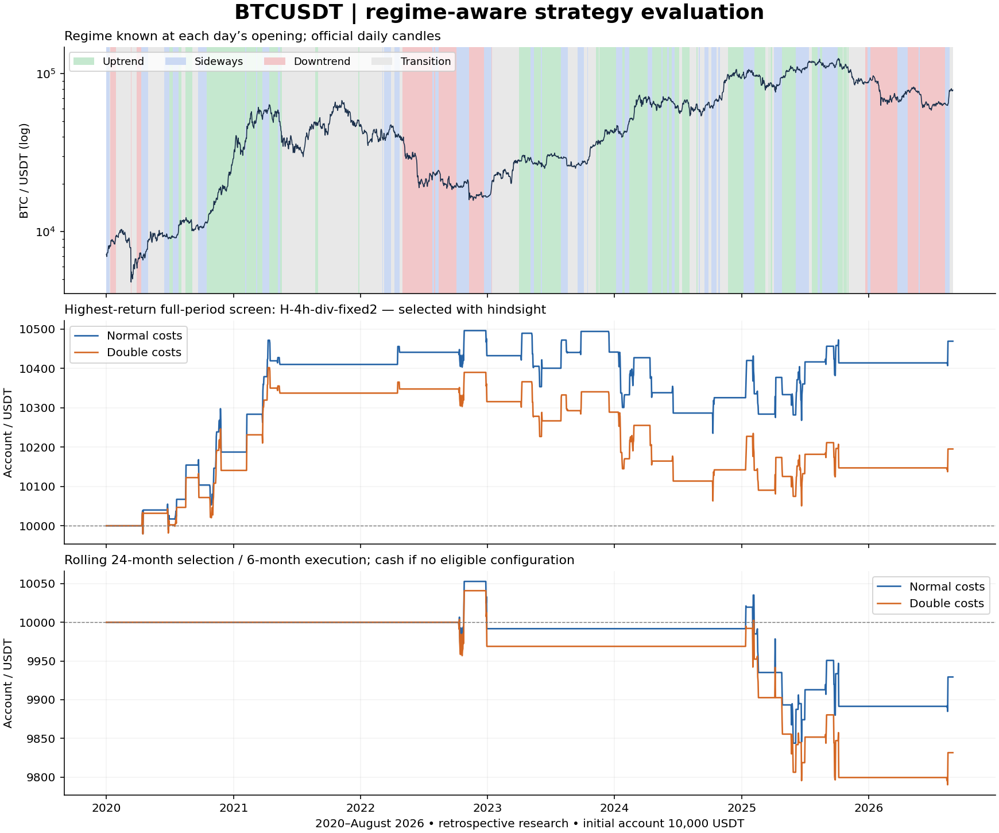

# BTCUSDT round 3: Fibonacci, regimes, divergence and adaptive exits

Evaluation: 1 January 2020–31 August 2026, with history from January 2018. BTCUSDT spot, long only. All periods are research-exposed.

## Decision
The requested 60% hit rate with strong average-win/average-loss profitability is **not established**. The highest-return new configuration in the full-period screen is **H-4h-div-fixed2**, returning +4.69% at normal costs and +1.95% at doubled costs. Its hit rate is 47.0% across 66 positions, with payoff 1.47 and profit factor 1.30. This is a hindsight-selected screen, not an independently validated winner.

The predeclared rolling selection returns **-0.71%**, falling to **-1.68%** with doubled costs; 23 positions, 43.5% hit rate, profit factor 0.86. Do not deploy this strategy on this evidence.

## What changed
Daily SMA200, its 20-day slope and ADX classify trend/range/transition conditions. Uptrend entries use confirmed 38.2%–61.8% Fibonacci retracements with rising RSI14; a second variant additionally requires confirmed hidden bullish divergence. Sideways entries use lower-Bollinger-band rejection with rising RSI. Downtrend and transition conditions allow no new position; existing positions exit at the next eligible event.

Two entry timeframes (1h and 4h), two confirmations, and three exit policies produce twelve configurations. Fixed targets are 1.5R or 2R. Adaptive exits use a 3R cap, cost-adjusted breakeven after 1R, then a completed-bar 2-ATR trailing stop after 2R. Every version has an initial protective stop and maximum holding time. See [the recorded specification](../BTC-ROUND-3-SPEC.md) for exact rules.

## All new configurations
Returns are total account returns over the entire period, not annual returns. Payoff is average net winning position divided by average absolute net losing position; profit factor is gross net-position profits divided by absolute net-position losses. Cost scenarios are separate replays, including their entry-cost filter, so trade counts can differ.

| Configuration | Trades | Hit rate | Payoff | Profit factor | Net return | Double-cost return |
|---|---:|---:|---:|---:|---:|---:|
| H-4h-div-fixed2 | 66 | 47.0% | 1.47 | 1.30 | +4.69% | +1.95% |
| H-4h-div-fixed1.5 | 67 | 50.7% | 1.23 | 1.26 | +3.82% | +1.81% |
| H-4h-div-adaptive | 66 | 50.0% | 0.93 | 1.06 | +0.75% | -2.10% |
| H-4h-rsi-fixed2 | 112 | 39.3% | 1.56 | 1.01 | +0.35% | -3.80% |
| H-4h-rsi-adaptive | 117 | 38.5% | 1.22 | 0.98 | -0.44% | -6.67% |
| H-4h-rsi-fixed1.5 | 115 | 42.6% | 1.27 | 0.94 | -1.70% | -5.10% |
| H-1h-div-fixed2 | 234 | 36.3% | 1.58 | 0.90 | -4.62% | -10.75% |
| H-1h-div-fixed1.5 | 233 | 40.8% | 1.14 | 0.78 | -9.68% | -12.87% |
| H-1h-div-adaptive | 250 | 40.8% | 0.89 | 0.69 | -11.29% | -22.17% |
| H-1h-rsi-fixed2 | 417 | 34.1% | 1.56 | 0.81 | -17.11% | -26.90% |
| H-1h-rsi-adaptive | 462 | 31.8% | 1.18 | 0.69 | -22.08% | -40.26% |
| H-1h-rsi-fixed1.5 | 438 | 38.4% | 1.16 | 0.72 | -23.46% | -27.73% |

## Frozen breakout comparison
The legacy run keeps the original aggregated daily data; the corrected run uses authoritative daily candles with identical breakout rules. Any change between these baselines is a data-coverage effect.

| Configuration | Trades | Hit rate | Payoff | Profit factor | Net return | Double-cost return |
|---|---:|---:|---:|---:|---:|---:|
| BASELINE-LEGACY-E-4h-3R | 51 | 41.2% | 2.20 | 1.54 | +6.46% | +3.38% |
| BASELINE-DAILY-E-4h-3R | 89 | 34.8% | 2.22 | 1.19 | +4.05% | -0.35% |

## Market regimes
For the highest-return new full-period configuration, positions grouped by the regime at entry:

| Entry regime | Positions | Hit rate | Payoff | Profit factor | Net position P&L / USDT |
|---|---:|---:|---:|---:|---:|
| uptrend | 18 | 44.44% | 1.40 | 1.12 | +58.77 |
| sideways | 48 | 47.92% | 1.51 | 1.39 | +410.26 |
| downtrend | 0 | — | — | — | +0.00 |
| transition | 0 | — | — | — | +0.00 |
| unknown | 0 | — | — | — | +0.00 |

Daily account returns grouped by the regime known at the day's opening. These are non-contiguous return slices, not separately investable portfolios; multiplying their growth factors reconstructs the account total. They are not the same grouping as entry-regime P&L. BTC comparison uses exact observed daily open/close endpoints and no fees.

| Daily regime | Days | Screen account | Rolling account | BTC same-day slice |
|---|---:|---:|---:|---:|
| uptrend | 715 | +0.14% | -2.32% | +129.64% |
| sideways | 568 | +4.49% | +1.44% | +391.84% |
| downtrend | 403 | +0.00% | +0.00% | -78.51% |
| transition | 749 | +0.06% | +0.22% | +352.68% |
| unknown | 0 | +0.00% | +0.00% | +0.00% |

Downtrend performance measures the cash/exit policy, not a profitable short-selling strategy. Small nonzero returns can arise while exiting a position entered under the preceding regime. Sideways is an ADX-based causal label and can include days with substantial cumulative BTC gains; it is not a hindsight claim that prices stayed within one range.

## Rolling selection and uncertainty
Each fold uses the previous 24 months to choose one configuration with at least 20 positions, positive mean net R, positive return and no gap-affected positions. It holds that configuration for six months; no eligible candidate means cash. Doubled-cost replay uses the same choices. Forced liquidation at fold boundaries is included.

| Fold start | Selected configuration | Normal net return | Double-cost net return |
|---|---|---:|---:|
| 2020-01-01 | Cash | +0.00% | +0.00% |
| 2020-07-01 | Cash | +0.00% | +0.00% |
| 2021-01-01 | Cash | +0.00% | +0.00% |
| 2021-07-01 | Cash | +0.00% | +0.00% |
| 2022-01-01 | Cash | +0.00% | +0.00% |
| 2022-07-01 | H-4h-rsi-fixed2 | -0.08% | -0.31% |
| 2023-01-01 | Cash | +0.00% | +0.00% |
| 2023-07-01 | Cash | +0.00% | +0.00% |
| 2024-01-01 | Cash | +0.00% | +0.00% |
| 2024-07-01 | Cash | +0.00% | +0.00% |
| 2025-01-01 | H-4h-div-adaptive | -1.18% | -1.51% |
| 2025-07-01 | H-4h-div-fixed1.5 | +0.18% | -0.20% |
| 2026-01-01 | H-4h-div-fixed1.5 | +0.00% | +0.00% |
| 2026-07-01 | H-4h-rsi-fixed1.5 | +0.38% | +0.33% |

The screen winner's Wilson 95% hit-rate interval is 35.4%–58.8%. Its three-month circular-block bootstrap interval for mean net R is -0.065 to +0.381; this does not correct for choosing a winner among many tests.

Screen maximum drawdown: -2.94%; worst month: -1.31%; worst year: -1.11%; average exposure: 0.98%. Rolling daily-close maximum drawdown: -2.08%; worst month: -0.84%; worst year: -1.00%. Five-minute gaps affected 1 screen-winner positions and 0 rolling positions. Affected executions remain provisional.

## Data correction and reproducibility
The preliminary run classified 1,078 of 2,435 evaluation days as unknown because missing intraday bars invalidated aggregated daily candles and repeatedly reset SMA200. The amended run uses separately checksum-verified Binance daily archives for daily indicators, while retaining all 1,847 missing/blocked five-minute bars, including exclusion of 241 off-grid timestamps. The daily archive contains 3,165 complete candles. All 3,134 complete intraday days exactly match native daily OHLC; 31 days contain intraday gaps. No execution prices were filled. Daily regime coverage now has zero unknown evaluation days.

Rules were frozen in commit `c921695cf2cf876f1d62241f4f863c1455be0b55`; the data-method amendment and 38 passing tests were committed as `ade55f92b8d4adb35a06187603390ad5e2f62810` before the corrected run. The amendment changed data coverage, not trading thresholds. [Preliminary audit](btc-round-3-preliminary-audit.json) preserves superseded comparisons.

Start capital 10,000 USDT; 0.5% planned trade risk, 25% initial allocation cap, no leverage. Normal costs assume 0.10% fee and 0.02% slippage each side. Entries use next opens; stop/target ambiguity within five-minute candles resolves stop first. Fixed quantity/minimum-notional assumptions, gaps, approximate fills, sparse samples and multiple testing limit conclusions. Native daily data are from [Binance public archives](https://github.com/binance/binance-public-data).

[Machine-readable snapshot](btc-round-3-results.json) · [Comparison CSV](btc-round-3-comparison.csv) · [Pinned Colab notebook](../notebooks/BTCUSDT-Round-3.ipynb) · [Independent workflow run](https://github.com/sat79/finance-portfolio/actions/runs/34910758348)

Full ledgers, daily equity, training candidates, checksum manifests and settings are in the run artifact and the [permanent result archive](btc-round-3-full-results.zip). All 42 screen/baseline/combined rows matched the independent GitHub run in trade count, hit rate and net return within 1e-9; the verification snapshot is retained. No live orders or exchange credentials are involved. Next research should test distinct hypotheses with a fresh forward period; repeated tuning of this history cannot establish the requested future hit rate.
